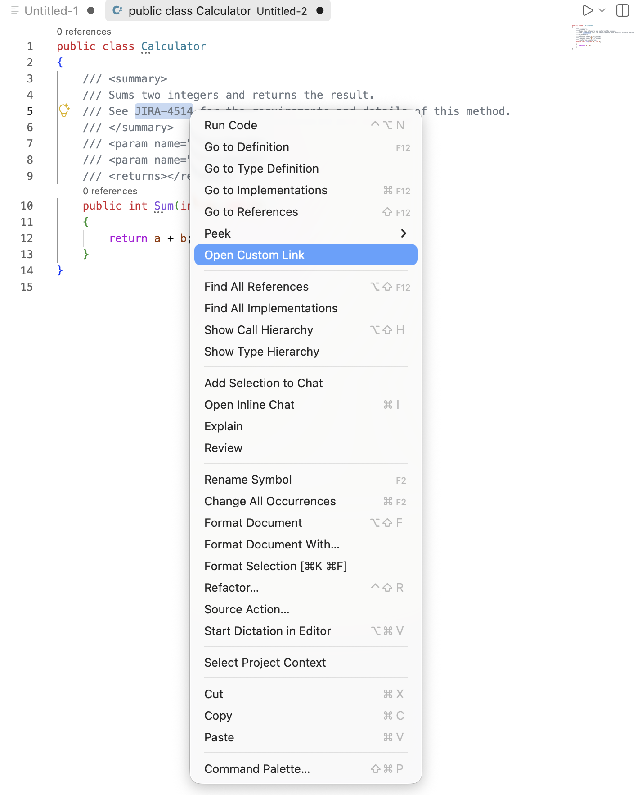

# Custom Link Opener

Custom Link Opener is a VS Code extension that adds a single editor context-menu action for selected text. It matches the current selection against configured URL patterns and opens the matching URL in the browser.

This is useful for linking ticket IDs, issue keys, or other selected values to internal tools such as Jira.

You can configure multiple URL mappings. Each mapping includes a URL template and a sample selection used to determine which URL should open for the current text.

## Features

- Shows one context-menu item when text is selected in the editor
- Matches the current selection to the first configured URL pattern that fits
- Supports multiple configurable URL mappings through the settings UI
- Lets each mapping define its own URL template and sample selection
- Works with text such as `ABC-123`, `DE+65`, `DE_65_45` , or `PROJ-42`

## Example

If the configuration is:

- URL template: `https://jira.mycompany.com/issues/{selection}`
- Selected text: `ABC-123`

The extension opens:

- `https://jira.mycompany.com/issues/ABC-123`

## How to use

1. Select any text in the editor.
2. Right-click the selection.
3. Choose `Open Custom Link`.
4. The extension automatically opens the matching configured URL in your default browser.

## Extension settings

This extension contributes the following setting:

- `customlinkopener.items`
  - An array of configurable URL mappings.
  - Each item supports:
    - `URL` for the URL template
    - `Sample Selection` for the sample value used to match the current selection

## Notes

- The context-menu item only appears when text is selected, otherwise context-menu item isn't visible.
- Selected text is URL-encoded before it is inserted into the target URL.
- The first configured item whose sample selection matches the current text will be used.

## Requirements

- VS Code `1.137.0` or newer
- A default browser configured on the machine

## Release notes

### 0.0.1

- Initial release
- Added selectable text context menu support
- Added customizable URL and selection text

## Contributing

This extension was created as a simple, customizable opener for internal tools and issue trackers. You can adapt the URL template to match your own workflow or company system.
